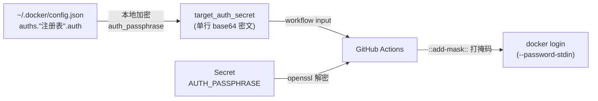

# 凭据加密与打掩码

mtrans 的安全契约：**凭据不落配置文件、不进日志**（ADR-0002）。

## 传输链路



- **源**：登录凭据 `auth`——`~/.docker/config.json` 中 `auths."<注册表域名>".auth` 的原值，base64 编码的 `用户名:密码`。
- **加密**：`sync` 触发时本地读取 `auth`，用 `[setting].auth_passphrase` 加密成加密串，作为 workflow input `target_auth_secret` 传入。
- **解密**：流水线内用仓库 Secret `AUTH_PASSPHRASE`（值须与 `auth_passphrase` 一致）解密。

## 加密算法

与 openssl 逐字节配对（本地实现在 `src/crypto.rs`，以 openssl 参考向量 + 真实互解测试锚定）：

```bash
# 本地加密
openssl enc -aes-256-cbc -pbkdf2 -a -A -pass "pass:<auth_passphrase>"
# 流水线内解密
openssl enc -d -aes-256-cbc -pbkdf2 -a -A -pass "pass:$AUTH_PASSPHRASE"
```

格式为 `Salted__` magic + 8 字节随机盐 + AES-256-CBC/PKCS7，PBKDF2-HMAC-SHA256 10000 轮派生 key 32 字节 + IV 16 字节，输出单行 base64。

## 安全性质

- **传输通道只暴露密文**：拿到 run payload 也无法还原凭据。
- **加密口令只存在于两处**：本地 `config.toml` 与目标仓库 Secret，均不在事件 payload 中。
- **每次加密使用随机盐**：同一凭据两次触发的密文不同，无法以密文做指纹比对。
- **配置文件只存口令**：凭据本体始终只在 `~/.docker/config.json`。

## 流水线日志打掩码

GitHub Actions 的 `::add-mask::` 把日志中匹配的字符串替换为 `***`，但有陷阱：

!!! danger "绝不在 run 脚本中内联 `${{ }}` 读取密钥"

    runner 执行 run 脚本前会**先回显整个脚本**，`${{ }}` 表达式在回显时已被替换为实际值——必然明文落日志，且早于 `::add-mask::` 执行。因此 `target_auth_secret` 与 `secrets.AUTH_PASSPHRASE` **必须经 step 级 `env:` 传入**（env 值不回显，脚本回显中只有变量名）。

打掩码顺序：脚本内依次对 `AUTH_PASSPHRASE`、解密出的 `auth`（base64）、解码出的**用户名**、**密码**分别 `::add-mask::`，再进行 `docker login` 与拉取/推送。由于掩码仅对命令执行后的日志生效，模板把 env 传入、解密、解码、打掩码、登录**收敛为同一步骤**执行（见 `docker mtrans ci` 生成的 YAML）。

## 降低泄露面

- 密码经 stdin 传入 `docker login ... --password-stdin`，不进命令行参数。
- 工作流内不保存凭据；运行记录（含日志）在成功且 `keep_run = false` 时由本地自动删除。
- 代价：`sync`/`pull` 前必须已 `docker login` 目标注册表（未登录在入口报错）；轮换口令时本地与 Secret 两处同步更新。
