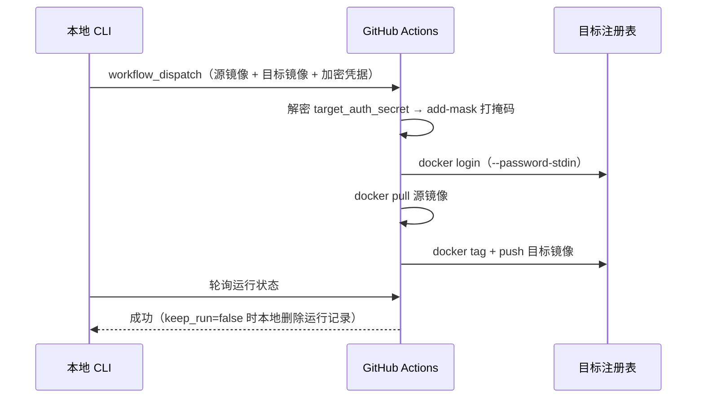

# 部署 GitHub Actions 工作流

复制**一律由 GitHub Actions 工作流托管完成**（ADR-0001）：本地只触发与轮询，Runner 完成拉取与推送。本机不直连目标注册表做复制。

## 为什么走远程

| 收益 | 代价 |
| --- | --- |
| 免去本机直连目标注册表的配置与暴露面 | 强依赖 GitHub 仓库与具备 `actions: write` 的 Token |
| 复制日志可在流水线侧审计 | 复制过程本机不可见，经工作流日志观察 |
| 本机不承担镜像层传输 | — |

## 生成模板

```bash
# 打印到 stdout
docker mtrans ci

# 保存到文件（已存在时提示是否覆盖）
docker mtrans ci docker-mtrans.yml
```

工作流定义 `workflow_dispatch`，inputs 有三个：

| input | 说明 |
| --- | --- |
| `source_image` | 源镜像 |
| `target_image` | 目标镜像（必须含注册表域名，如 `ghcr.io/user/repo:tag`） |
| `target_auth_secret` | 目标注册表登录凭据加密串（本地用加密口令加密的 `auth`） |

## 部署步骤

1. **生成模板**并放到 `[ci].repo` 仓库的 `.github/workflows/docker-mtrans.yml`（默认 `[ci].workflow = docker-mtrans.yml`，分支 `[ci].branch = main`）。
2. **配置 Secret**：在该仓库 *Settings → Secrets and variables → Actions* 添加 `AUTH_PASSPHRASE`，值与本地 `[setting].auth_passphrase` **一致**。
3. **确认权限**：工作流需要 `contents: read` 与 `packages: write`（模板已内置）；推送非 ghcr.io 注册表时由目标注册表凭据授权。

## 触发后的完整链路



## 运行记录

- 复制成功且 `keep_run = false`（默认）时，本地自动删除该次运行（连同日志），进一步降低泄露面。
- 需要留存审计日志时设 `keep_run = true`。

凭据如何在链路中加密与打掩码，见[凭据加密与打掩码](credentials.md)。
