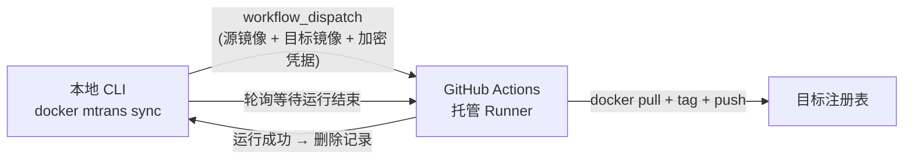

# mtrans — 容器镜像远程复制工具

**mtrans** 把容器镜像从源注册表复制到**目标注册表**，也可反向从目标注册表拉回本地并还原为源镜像名。Rust 编写的单文件 CLI，支持 **Windows / Linux / macOS** 三端，可独立运行（`docker-mtrans`），也可作为 docker CLI 插件（`docker mtrans ...`）。

## 核心特性

- :material-cloud-upload: **远程复制**：所有复制一律由 GitHub Actions 工作流托管完成（[ADR-0001](advanced/workflow.md)），本机不直接复制镜像层。
- :material-lock: **加密凭据传输**：凭据以 `~/.docker/config.json` 登录态为源，`sync` 时用加密口令加密后传入工作流，流水线内解密并打掩码——**不落配置文件、不进日志**（[ADR-0002](advanced/credentials.md)）。
- :material-layers-triple: **三种组合模式**：单仓库汇聚 / 仓库映射 / 固定中转，`sync` 与 `pull` 共用同一规则，保证往返对账（[组合规则](advanced/naming-rules.md)）。
- :material-tune: **覆盖参数**：`sync`/`pull`/`spull` 支持一次性覆盖目标注册表、组织、仓库与模式，不改配置文件。
- :material-laptop: **跨平台**：自动适配 Windows 命名管道与 Linux/macOS 套接字，配置路径尊重 `DOCKER_CONFIG`/`XDG_CONFIG_HOME`。
- :material-translate: **中英双语**：帮助与运行时输出按系统语言切换，默认英文。

## 工作原理

## 快速导航

| 我想… | 去这里 |
| --- | --- |
| 五分钟内跑通第一次复制 | [快速开始](quickstart.md) |
| 构建或安装二进制 | [构建与安装](install.md) |
| 了解配置文件怎么写 | [配置总览](config/index.md) |
| 查某个子命令的用法 | [命令总览](commands/index.md) |
| 弄清目标镜像名如何派生 | [目标镜像组合规则](advanced/naming-rules.md) |
| 理解凭据如何加密与打掩码 | [凭据加密与打掩码](advanced/credentials.md) |
| 部署 GitHub Actions 工作流 | [部署工作流](advanced/workflow.md) |
